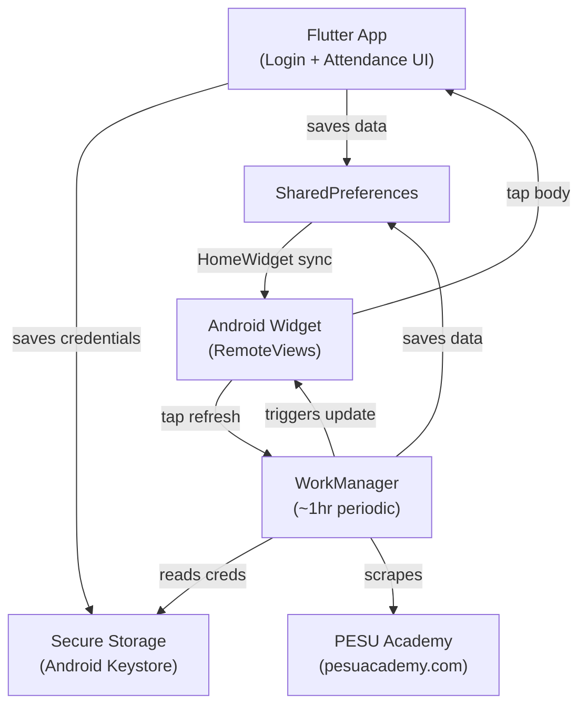

# PESU Attendance Widget — Walkthrough

## What Was Built

A production-ready Flutter app + Android home screen widget that:
- Scrapes PESU Academy for real attendance data (no mock/fake data)
- Displays subject-wise + overall attendance with color coding
- Auto-refreshes every ~1 hour via WorkManager
- Works even when the app is closed

---

## Architecture



---

## Project Structure (24 files)

| Layer | File | Purpose |
|-------|------|---------|
| **Models** | [attendance.dart](file:///d:/attendance/lib/models/attendance.dart) | [SubjectAttendance](file:///d:/attendance/lib/models/attendance.dart#6-47), [AttendanceData](file:///d:/attendance/lib/models/attendance.dart#48-93) with JSON serialization |
| **Scraper** | [pesu_scraper.dart](file:///d:/attendance/lib/services/pesu_scraper.dart) | CSRF login → semester fetch → attendance HTML parsing. 3× retry with exponential backoff |
| **Storage** | [storage_service.dart](file:///d:/attendance/lib/services/storage_service.dart) | Credential encryption, SharedPrefs persistence, widget data sync |
| **Background** | [background_service.dart](file:///d:/attendance/lib/services/background_service.dart) | WorkManager periodic task (1hr), manual refresh callback |
| **UI — Entry** | [main.dart](file:///d:/attendance/lib/main.dart) | App init, HomeWidget callback, auto-route by credentials |
| **UI — Login** | [login_screen.dart](file:///d:/attendance/lib/screens/login_screen.dart) | Dark premium login with SRN/password fields |
| **UI — Data** | [attendance_screen.dart](file:///d:/attendance/lib/screens/attendance_screen.dart) | Overall ring + subject cards with pull-to-refresh |
| **Widget — Kotlin** | [AttendanceWidgetProvider.kt](file:///d:/attendance/android/app/src/main/kotlin/com/example/pesu_attendance/AttendanceWidgetProvider.kt) | Reads synced data, renders RemoteViews, wires intents |
| **Widget — Layout** | [attendance_widget.xml](file:///d:/attendance/android/app/src/main/res/layout/attendance_widget.xml) | Dark card with percentage, color bar, refresh button |
| **Manifest** | [AndroidManifest.xml](file:///d:/attendance/android/app/src/main/AndroidManifest.xml) | Widget receiver + HomeWidget background service |

---

## How the Scraper Works

Ported from the [pesu-dev/pesuacademy](https://github.com/pesu-dev/pesuacademy) Python library:

1. `GET /Academy/` → extract `<meta name="csrf-token">` from login page
2. `POST /Academy/j_spring_security_check` with `_csrf`, `j_username`, `j_password`
3. `GET /Academy/a/studentProfilePESU/getStudentSemestersPESU` → parse `<option>` tags for semester IDs
4. `GET /Academy/s/studentProfilePESUAdmin?menuId=660&controllerMode=6407&actionType=8&batchClassId=<semId>` → parse attendance `<table class="box-shadow">`

Cookie management is handled manually with a `Map<String, String>` to maintain session across requests.

---

## Setup Instructions

### Prerequisites
- Flutter SDK 3.0+ installed and on PATH
- Android SDK with API 34
- An Android device or emulator (API 21+)

### Steps

```bash
# 1. Navigate to the project
cd d:\attendance

# 2. Set local.properties (Flutter does this on first run too)
# Make sure android/local.properties has:
#   sdk.dir=C:\\Users\\<you>\\AppData\\Local\\Android\\sdk
#   flutter.sdk=C:\\path\\to\\flutter

# 3. Get dependencies
flutter pub get

# 4. Run on device (debug)
flutter run

# 5. Or build APK
flutter build apk --debug
```

### After Install
1. Open the app → enter your **PESU SRN** and **password** → tap **Sign In**
2. View your subject-wise attendance with color coding
3. Go to home screen → **long press** → **Widgets** → find **PESU Attendance** → add
4. The widget shows your overall percentage with automatic hourly refresh
5. Tap the **refresh icon** (↻) on the widget for manual refresh
6. Tap the widget body to open the full app

---

## Widget Color Logic

| Range | Color | Meaning |
|-------|-------|---------|
| ≥ 85% | 🟢 Green `#22C55E` | Safe |
| 75–85% | 🟡 Yellow `#FACC15` | Warning |
| < 75% | 🔴 Red `#EF4444` | Danger zone |

---

## Security

- Credentials stored in **Android Keystore** via `flutter_secure_storage` (encrypted)
- Credentials never leave the device except to `pesuacademy.com` directly
- No third-party servers involved (the `pesu-auth.onrender.com` API is **not** used)
- Password is never stored in SharedPreferences or plain text

---

## Battery & Performance

- WorkManager respects Android's battery optimization constraints
- `requiresBatteryNotLow: true` — won't refresh when battery is low
- `networkType: NetworkType.connected` — won't attempt when offline
- Minimum interval respects Android's 15-minute floor
- Session cookies are maintained within a task to minimize repeated logins
